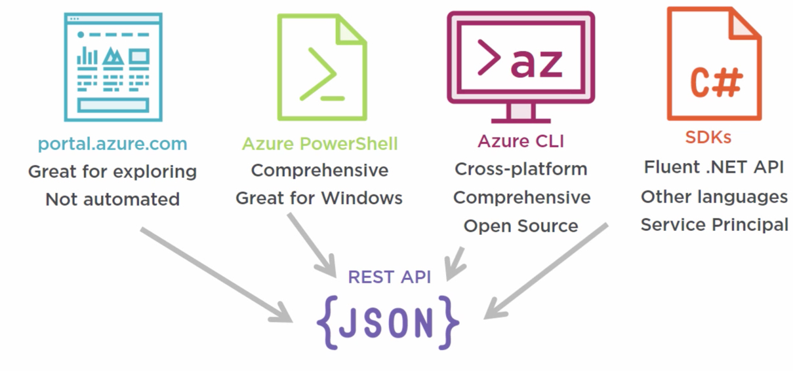

# Azure Automation

## Official Microsoft Technical Documentation for languages-and-tools

- https://docs.microsoft.com/en-us/azure/?product=popular#languages-and-tools

 
 
 
 

## (All Azure Services) is made with REST API {JSON}

## (Automation Level: No Automation)
- https://portal.azure.com
  - Great for exploring 

- https://preview.portal.azure.com
  - Great for exploring for Early Adapters
  

- https://dev.azure.com
  - Good for Discovery and Learning when using DevOps pipeline 

## (Automation Level: Walking)
- [REST API {JSON}](https://docs.microsoft.com/en-us/rest/api/) 
	- Low Level HTTP communication 
	- We need to authenticate and take care of security Tokens lifecycle
	- Need to send AccessToken on every HTTP Request and pass as param()
	- Need to parse HTTP Response back and check for data of type (JSON or HTML on Error)
	- Need to Serialize/DeSerialize from HTTP Response to Object 
	- Need to care about HTTP status codes when service become Unhealthy
	- Heavy use of If-Else inside PowerShell 
	- No Retry pattern built-in 
	- No Default Error handling built-in
	- Heavy use fo Chatty communication 

## (Automation Level: Running)
- [Azure PowerShell](https://docs.microsoft.com/en-us/powershell/azure/?view=azps-7.3.0)
  - When Microsoft change the Module version ["6.6.0","7.2.0","7.3.0"], we need to align
  - Not Easy to use if not in love with PowerShell
  - Not Using Desire state (you need to write If-Else)
  - We need to follow PowerShell mindset [Modules, cmdLet pipeline, naming changes, breaking changes, compatibility]

## (Automation Level: Flying)
- [Azure-CLI](https://docs.microsoft.com/en-us/cli/azure/) 
  - Built-In Versioning (Not using PowerShell Modules)
  - Easy to use than Azure PowerShell
  - We can automate more services with less effort
  - Using Desire State (Idempotent)
  	- If you run az command first time (on BigBang) --> Insert
  	- If you run az command again (Rolling Update)  --> Update
  	- If you run az command always in Continuous 	--> UpSert
  - Can be integrated in PowerShell CmdLets as encapsulation for reusability

 
 

